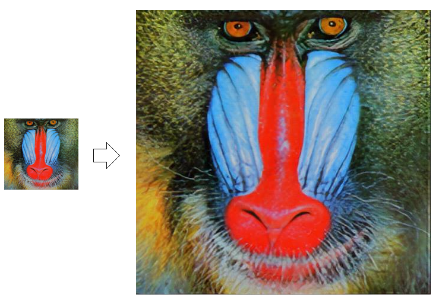
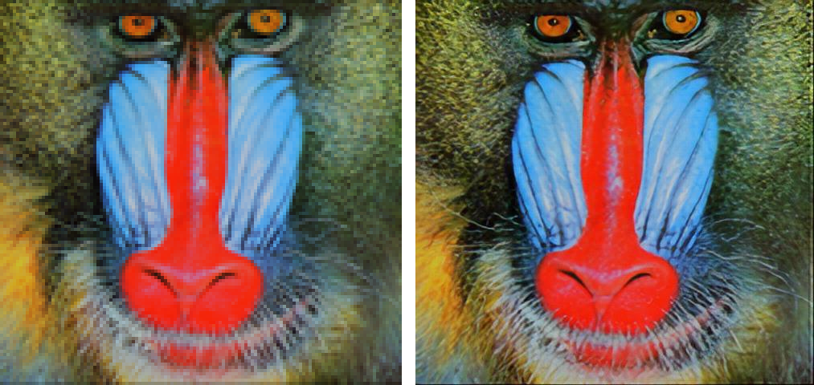

# TF Hub Wrapper - ESRGAN
This package contains functions to properly load and process images for input to Google's ESRGAN model posted on the Tensorflow Hub.

<a href=#>
    
</a>

### Usage
First, install the package with pip:
```
pip install tfhub-esrgan-wrapper
```
Then import the package:
```
from tfhub_esrgan_wrapper import ESRGAN, save_image
```
And call the hub evaluation function:
```
esrgan = ESRGAN()
esrgan.load_image("input.jpg")
highres_image = esrgan.evaluate(False)
save_image(highres_image, "output.jpg")
```
This will generate a super-resolution version of the input image, upscaled by four and at a higher quality than other upscaling methods.

Below shows a comparison between an upscaled version of the input picture using Microsoft Paint and the upscaled super-resolution output of the ESRGAN model:
<a href=#>
    
</a>
